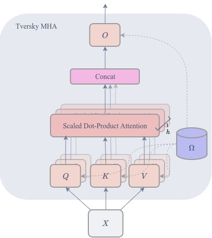
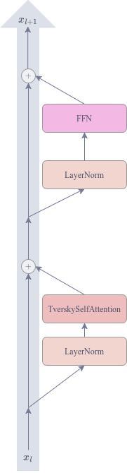
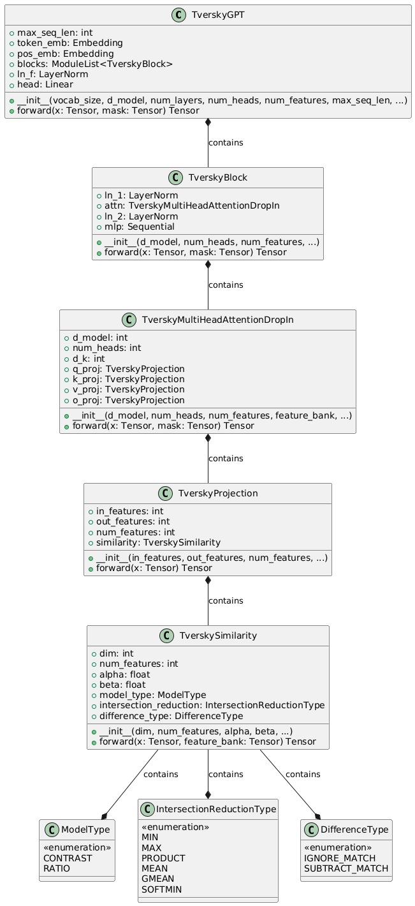

# Модуль механизма внимания на основе меры сходства Тверски для повышения параметрической эффективности языковых моделей

Ключевые слова: механизм внимания, мера сходства Тверски, параметрическая эффективность

## Определения, обозначения и сокращения

**Механизм нимания (Self-Attention)** - техника для вычисления попарной "схожести" между токенами входной последовательности.

**Параметрическая эффективность** - характеристика нейросетевой архитектуры, отражающая ее способность достигать высокой точности при минимизации общего числа обучаемых параметров.

**Языковая модель** - алгоритм искусственного интеллекта, обученный для понимания, обработки и генерации естественного языка.

**Токен** - единица обработки текстовых данных (слово, часть слова или символ).

**Эмбеддинг** - непрерывное векторное представление дискретного объекта.

**Перплексия (Perplexity, PPL)** - метрика оценки качества языковых моделей, количественно отражающая "неуверенность" модели при предсказании следующего токена.

**Бенчмарк** - набор задач, используемый для оценки качества и скорости модели.

## Аннотация

TODO: rewrite

Работа посвящена проблеме структурной оптимизации нейросетевых языковых моделей на базе архитектуры Transformer. Рассмотрено противоречие между симметричной природой стандартного механизма внимания и необходимостью моделирования направленных семантических связей в тексте, что вынуждает использовать избыточные матрицы проекций. В статье проведен обзор существующих аналогов и выявлены их ограничения. Предложен метод Tversky Self-Attention, который благодаря использованию дифференцируемой теоретико-множественной метрики позволяет использовать единую матрицу проекции для запросов и ключей и глобальный банк признаков, потенциально сокращая количество параметров слоя внимания. В результате была разработана математическая модель и методика сравнительного экспериментального исследования эффективности предложенного подхода.

## Введение

В последние годы механизмы внимания стали базовым компонентом многих современных архитектур искусственного интеллекта, демонстрируя выдающиеся результаты в задачах обработки естественного языка, изображений и других модальностей, а также для мультимодальных задач. Так, по состоянию на 2026 год, архитектура Transformer [1] и ее модификации доминируют в индустрии. Это подтверждается тем, что данная архитектура лежит в основе всех ведущих коммерческих и открытых больших языковых моделей демонстрирующих наивысшую производительность в бенчмарках, включая семейства моделей GPT, Gemini и Claude [2].

Однако масштабирование подобных архитектур сопряжено с проблемой избыточности параметров. Классический механизм Multi-Head Attention требует использования независимых полносвязных матриц для проекции запросов, ключей, значений и выходных представлений ($W^Q, W^K, W^V, W^O$) в каждом слое. Подобный подход приводит к стремительному росту числа параметров, что значительно ограничивает использование LLM в условиях ограниченных ресурсов. Существующие методы сжатия и оптимизации, такие как стандартное связывание весов или переиспользование параметров между слоями (как в ALBERT), лишь частично решают проблему, поскольку они не меняют саму парадигму сопоставления токенов, а лишь дублируют или ограничивают размерности линейных проекций.

Альтернативную парадигму сопоставления объектов предлагает психологическая теория Амоса Тверски [3]. В отличие от жестких ограничений метрических пространств, данная теория опирается на теоретико-множественный анализ, где сходство двух объектов определяется как линейная комбинация мер их общих и отличительных признаков.

До недавнего времени применение меры сходства Тверски в архитектурах глубокого обучения было ограничено из-за дискретной природы операций над множествами, которые не поддаются дифференцированию, что приводило к невозможности использования методов обратного распространения ошибки. Ситуация радикально изменилась с публикацией фундаментального исследования [4]. В этой работе была представлена полностью дифференцируемая параметризация меры Тверски, позволившая заменить стандартные линейные слои на "проекционные слои Тверски". Было показано, что замена линейных слоев на слои Тверски позволяет не только улучшить метрики качества (снижение перплексии GPT-2 на 7.8%), но и сократить количество параметров модели на 34.8% в задачах языкового моделирования на датасете PTB.

Тем не менее, данные исследования ограничились заменой лишь выходной проекции механизма внимания $W^O$, оставив без внимания остальные компоненты механизма внимания - проекции ключей $W^K$, запросов $W^Q$ и значений $W^V$, что могло бы привести к еще большему сокращению числа параметров.

**Объектом исследования** являются механизмы внимания в нейросетевых моделях для обработки естественного языка.

**Предметом исследования** является зависимость параметрической эффективности языковых моделей от метода связывания весов с использованием меры сходства Тверски.

**Цель работы:** исследование метода повышения параметрической эффективности механизма внимания путем замены линейных слоев на проекционные слои Тверски с разделяемым семантическим пространством.

Для достижения поставленной цели в работе решаются следующие задачи:

1. Разработка формального математического описания модуля механизма внимания, использующего дифференцируемую меру сходства Тверски.
2. Анализ параметрической эффективности предложенного метода по сравнению с базовым Scaled Dot-Product Attention.
3. Обоснование и формирование методики экспериментального исследования для оценки параметрической эффективности проектируемого модуля.
4. Реализация прототипа механизма внимания на основе меры сходства Тверски на фреймворке PyTorch.
5. Проведение сравнительного эксперимента на архитектуре GPT для оценки влияния предложенного метода на перплексию и количество параметров модели.

## 1. Обзор предметной области

### 1.1. Принцип отбора аналогов

Поиск аналогов осуществлялся среди современных модификаций механизма внимания в архитектурах Transformer по двум ключевым направлениям, соответствующим проблематике исследования: использование общих весов в слое внимания и методы повышения параметрической эффективности. Отбор производился по базам данных arXiv и Google Scholar с использованием ключевых слов: "alternative attention", "shared attention layer", "attention optimization", "parameter efficient attention".

*Multi-Head Self Attention (MHA)* - механизм внимания, лежащий в основе архитектуры Transformer [1], является стандартом для LLM. Для каждой "головы" внимания выделяются независимые матрицы проекций для запросов, ключей и значений, а выходная проекция объединяет результаты каждой из "голов":

$$
\begin{aligned}
    & \text{MultiHead}(Q, K, V) = \text{Concat}(\text{head}_1, ... , \text{head}_h)W^O \\
    & \text{head}_i = \text{Attention}(QW^Q_i, KW^K_i, VW^V_i)\\
    & \text{Attention}(Q, K, V) = \text{softmax}\left(\frac{QK^T}{\sqrt{d_k}}\right)V \\
\end{aligned}
$$

Независимость матриц для каждой головы приводит к высокой обобщающей способности, но влечет за собой большое количество параметров. Вычислительная сложность MHA растет квадратично относительно длины входной последовательности, а количество параметров для одного слоя MHA - $4d^2$ параметров ($d^2$ для каждой проекции).

*Linformer* - базируется на обосновании того факта, что полноразмерная матрица внимания обладает низкоранговой структурой, то есть содержащаяся в ней информация может быть приближена без большого ущерба для качества [5]. В данном методе вводятся дополнительные проекции $E, F \in \mathbb{R}^{n \times k}$, которые сжимают матрицы ключей и значений вдоль измерения длины последовательности до размерности $k \ll N$:

$$
\text{head}_i = \text{Attention}(Q W^Q_i , E_i K W^K_i , F_i V W^V_i )
$$

Внедрение низкоранговой проекции позволяет снизить асимптотическую сложность механизма внимания по времени и памяти с до $\mathcal{O}(N \cdot k)$. Тем не менее из-за введения параметра $k$, качество модели на последовательностях длины, большей чем те, что присутствовали в обучающей выборке, сильно снижается.

*MQA (Multi-Query Attention) и GQA (Grouped-Query Attention)* - разработаны для решения проблемы дефицита пропускной способности памяти, возникающей при загрузке KV-кэша. В MQA вместо независимых матриц ключей и значений для каждой из $h$ голов используется одна пара проекций, использующаяся для всех голов запросов, что снижает размер KV-кэша в $h$ раз [6]:

$$
\text{head}_i = \text{Attention}(QW^Q_i, KW^K, VW^V)
$$

В GQA в свою очередь головы запросов делятся на $g$ групп, и каждая группа делит одну проекцию ключей и значений [7].

Использование MQA обеспечивает ускорение инференса до 12 раз и позволяет пропорционально увеличивать размер пакета при обучении, однако может приводить к деградации качества и нестабильности обучения. GQA же улушает выразительную способность эмбеддингов, демонстрируя метрики на уровне MHA при скорости инференса, немногим ниже MQA.

*ALBERT (A Lite BERT)* - ориентирован на уменьшение размера модели посредством использования общих параметров между слоями и низкоранговому разложению матрицы эмбеддингов [8].

Благодаря таким оптимизациям, конфигурация ALBERT-xxlarge содержит на 30% меньше параметров и показатели бенчмарков на 1-8% выше, по сравнению с BERT-large, однако время итерации ALBERT-xxlarge в 3 раза выше в связи с увеличением количества вычислений.

*MASA (Matrix Atom Sharing in Attention)* - использует концепцию "словарного обучения" в архитектуре проекций, предполагая обучение словаря "матричных атомов", тогда как матрица конкретной проекции вычисляется как линейная комбинация этих компонентов [9].

Использование MASA позволяет сократить количество параметров модуля внимания на 50-66.7% в зависимости от числа параметров, при небольшом улучшении перплексии и точности на бенчмарках. Архитектура также позволяет интегрироваться в предобученные модели.

Для сравнения рассмотренных аналогов выбраны следующие критерии.

### 1.2. Критерии сравнения аналогов

*Отсносительное уменьшение параметров* - количественный критерий, отражающий параметрическую эффективность подхода путем сравнения с базовой версией, которая представлена в работе. Уменьшение числа параметров позволит хранить и использовать модель в условиях ограниченных ресурсов, например, на мобильных устройствах.

*Природа проекции* - качественный критерий, определяющий способ вычисления проекций в слое внимания. Матричные произведения (использующиеся в большиестве архитектур для вычисления проекций) ограничены в своей способности напрямую моделировать сложные нелинейные взаимосвязи на уровне одного слоя. Использование других способов проекций могло бы увеличить выразительную способность.

*Сохранение качества* - качественный критерий, оценивающий влияние сокращения числа параметров на итоговое качество модели. Метод повышения параметрической эффективности может считаться успешным, если итоговое качество модели не ухудшилось по сравнению с базовой версией с большим числом параметров, или улучшилось по сравнению с конфигурацией базовой версии с сопоставимым числом параметров.

### 1.3. Таблица сравнения аналогов

| Аналог    | Отсносительное уменьшение параметров | Природа проекции     | Сохранение качества                                                                                |
|-----------|--------------------------------------|----------------------|----------------------------------------------------------------------------------------------------|
| MHA       | 0%                                   | Линейная             | Базовый уровень                                                                                    |
| Linformer | до 50%, зависит от $k$               | Линейная             | Подвержен переобучению из-за ограничения ранга контекста.                                          |
| MQA и GQA | до 33%                               | Линейная             | MQA страдает от деградации качества, GQA демонстрирует качество на уровне MHA.                     |
| ALBERT    | до 90%                               | Линейная             | Использование общих парамеров может вызывать смещение внутренних представлений на глубоких слоях.  |
| MASA      | 50-66.7%                             | Модификация линейной | Демонстрирует качество на уровне MHA                                                               |

### 1.4. Выводы по итогам сравнения

Анализ литературы показывает, что параметрическая эффективность MHA может быть повышена кардинально разными подходами. Методы как ALBERT и MASA успешно демонстрируют, что большая часть весов может быть подвепгнута сжатию без больших потерь обобщающей способности, что делает возможным запуск LLM на периферийном оборудовании. В свою очередь, методы MQA и GQA, избавляясь от части параметров в "головах" MHA, сокращают объем KV-кэша необходимого во время инфересна, что удешевляет развертывания LLM для эксплуатации. Однако, второй критерий выявляет тренд во всех рассмотренных аналогов: они используют линейные проекционные слои.

Таким образом, среди рассмотренных работ нет подхода, который бы позволил одновременно повысить параметрическую эффективность языковой модели и использовать нелинейные проекции.

## 2. Выбор метода решения

### 2.1. Постановка задачи

Необходимо разработать **программный модуль механизма внимания**, интегрируемый в архитектуру GPT. Данный модуль должен заменять стандартный слой Multi-Head Attention, обеспечивая совместимость по входным и выходным тензорам для легкого встраивания разработанного решения в существующие архитектуры.

### 2.2. Требования к решению

Решение должно обладать следующими ключевыми качествами:

1. Взамен линейных проекций, решение должно использовать "проекции Тверски".
2. Используя свойства меры Тверски решение должно использовать общее простравнство признаков $\Omega$ внутри одного слоя MHA или для всей модели.

### 2.3. Обоснование требований к решению

1. Взамен линейных проекций, решение должно использовать "проекции Тверски". Это позволит внедрить нелинейную проекцию в слой MHA.
2. Используя свойства меры Тверски решение должно использовать общее простравнство признаков $\Omega$ внутри одного слоя MHA или для всей модели. Это обеспечит повышение параметрической эффективности разработанного метода.

## 3. Описание метода решения

### 3.1. Формальная модель проекционных слоев Тверски

В основе метода лежит предложенная в статье [5] параметризация меры сходства, базирующаяся на индексе Тверски.

Пусть $\Omega = \{f_k\}_{k=1}^{|\Omega|}$ - обучаемый банк признаков, где каждый $f_k \in \mathbb{R}^d$.
Входной объект описывается вектором $x \in \mathbb{R}^d$. Согласно [5], вводится двойственное представление объекта: как вектора $x$ и как множества $X$, состоящего из тех признаков банка $\Omega$, с которыми вектор $x$ имеет положительное скалярное произведение: $X=\left\{ f_k \in \Omega | x \cdot f_k > 0 \right\}$.

Мера сходства в модели контраста $S(a, b)$ между объектами $a$ и $b$ определяется уравнением:

$$
    S(a, b) = \theta f(A \cap B) - \alpha f(A - B) - \beta f(B - A)
$$

где $\theta, \alpha, \beta$ - обучаемые скалярные параметры, определяющие вес общих и отличительных признаков.

Также имеет место модель отношения, проигнорированная в рассматриваемой статье [5], которую также предложил Амос Тверски [3]. Она, в отличии от модели контраста, дает нормализованную (от 0 до 1) оценку сходства и определяется как:

$$
S(a, b) = \frac{f(A \cap B)}{f(A \cap B) + \alpha f(A - B) + \beta f(B - A) + \theta}
$$

где $\theta$ внедрен в знаменатель для обеспечения численной стабильности и предотвращения деления на ноль.

Проекционный слой Тверски выполняет сравнение объекта $x$ с набором из $p$ прототипов $\Pi_i \in \mathbb{R}^d$:

$$
\begin{aligned}
    & P: \mathbb{R}^d \to \mathbb{R}^p \\
    & P(a) =
    \begin{bmatrix}
        S(a, \Pi_1) \\
        S(a, \Pi_2) \\
        \vdots \\
        S(a, \Pi_p)
    \end{bmatrix}
\end{aligned}
$$

**Мера значимости** объекта определена как сумма мер всех признаков, присутствующих в нем:

$$
    f(A) = \sum_{k=1}^{|\Omega|} (a \cdot f_k) \cdot \mathbb{I}[a \cdot f_k > 0]
$$

**Мера пересечения** двух объектов определяет меру значимости общих признаков. Она вычисляется как сумма мер признаков, присутствующих одновременно в $A$ и $B$:

$$
    f(A \cap B) = \sum_{k=1}^{|\Omega|} \Psi(a \cdot f_k, \,\, b \cdot f_k)
    \cdot \mathbb{I}[a \cdot f_k > 0 \land b \cdot f_k > 0],
$$
где $\Psi$ - агрегирующая функция. В экспериментах статьи [5] исследуются следующие варианты $\Psi$:

$$
\begin{aligned}
    & \texttt{min:} \Psi(a, b)=(\min(a_1, b_1), \min(a_2, b_2), ..., \min(a_d, b_d)) \\
    & \texttt{max:} \Psi(a, b)=(\max(a_1, b_1), \max(a_2, b_2), ..., \max(a_d, b_d)) \\
    & \texttt{product:} \Psi(a, b)=(a_1 \cdot b_1, a_2 \cdot b_2, ..., a_d \cdot b_d) \\
    & \texttt{mean:} \Psi(a, b)=\left(\frac{a_1 + b_1}2, \frac{a_2 + b_2}2, ..., \frac{a_d + b_d}2\right) \\
    & \texttt{gmean:} \Psi(a, b)=(\sqrt{a_1 \cdot b_1}, \sqrt{a_2 \cdot b_2}, ..., \sqrt{a_d \cdot b_d}) \\
    & \texttt{softmin:} \Psi(a, b)=\left(\frac{a_1\exp(-a_1) + b_1\exp(-b_1)}{\exp(-a_1)+\exp(-b_1)}, ..., \frac{a_d\exp(-a_d) + b_d\exp(-b_d)}{\exp(-a_d)+\exp(-b_d)}\right) \\
\end{aligned}
$$

**Мера разности** двух объектов определяет меру значимости отличительных признаков. Представлены два варианта вычисления: `ignorematch` или `subtractmatch`:

$$
\begin{aligned}
    f^i(A - B) &= \sum_{k=1}^{|\Omega|} (a \cdot f_k) \cdot \mathbb{I}[a \cdot f_k > 0 \land b \cdot f_k \le 0] \\
    f^s(A - B) &= f^i(A-B) +
    \sum_{k=1}^{|\Omega|} (a \cdot f_k - b \cdot f_k) \cdot \mathbb{I}[b \cdot f_k > 0 \land a \cdot f_k > b \cdot f_k]
\end{aligned}
$$

В первом случае учитываются только признаки, которые есть в $a$ и нет в $b$, а во втором случае учитываются признаки, которые есть в $a$ и $b$, но их значимость в $a$ больше ($a \cdot f_k > b \cdot f_k$). Считается, что `subtractmatch` более выразителен, а `ignorematch` - его аппроксимация, которая требует меньше вычислительных затрат.

### 3.2. Реализация модуля Tversky Attenion

Интеграция описанной математической модели в слой Multi-Head Attention будет выполнятся с помощью замены линейных слоев проекции $W^Q$, $W^K$ и $W^V$ и $W^O$ на слои проекции Тверски. Тогда векторы запросов, ключей и значений формируются не как линейные преобразования входных эмбеддингов, а как векторы сходства Тверски каждого токена с набором прототипов $\Pi^Q, \Pi^K, \Pi^V, \Pi^O$ в пространстве глобального обучаемого банка признаков $\Omega$.

Данный подход эксплуатирует ключевое открытие авторов TverskyNN - совместное использование признаков [5]. Внутри одного блока или даже сквозь всю модель слои внимания могут разделять единый банк признаков $\Omega$, так как все они оперируют в едином семантическом пространстве.

Проекционный слой Тверски является полностью дифференцируемым, что позволяет обучать банк признаков $\Omega$ и наборы прототипов $\Pi$ методом обратного распространения ошибки вместе с остальной моделью.

## 4. Архитектура программной реализации

### 4.1 Используемые технологии

Программная реализация выполнена на языке программирования Python с применением ряда специализированных библиотек для глубокого обучения, NLP и обработки данных:

- **PyTorch (`torch`)** - фреймворк глубокого обучения с автоматическим дифференцированием. Используется для реализации модели, тензорных операций и циклов обучения. Сожержит реализации слоев,оптимизаторов и другого функционала, что позволяет легко создавать и обучать нейросетевые модели.
- **Hugging Face Datasets (`datasets`)** - библиотека для эффективного управления большими корпусами текстов и потоковой обработки данных. В рамках работы она используется для загрузки, кэширования и предварительной подготовки набора данных WikiText-2.
- **Hugging Face Transformers (`transformers`)** - библиотека для доступа к предварительно обученным моделям и токенизаторам. В рамках работы используется для загрузки токенизатора, совместимого с архитектурой GPT, и для сравнения с базовой реализацией GPT.
- **Matplotlib (`matplotlib`)** - библиотека для создания статических, анимированных и интерактивных визуализаций данных. В рамках работы используется для построения графиков динамики обучения.
- **tqdm** - лекговесная утилита для создания динамических индикаторов выполнения. Используется для информативного отображения прогресса обучения и валидации.

### 4.2 Структура программной реализации

#### 4.2.1 Реализованные классы и функции

**Вспомогательные перечисления**
Перечисления вынесены в отдельный модуль для строгой типизации конфигурации модели.

`ModelType`: Это перечисление используется для выбора формулировки меры Тверски. Содержит модель контраста и модель отношения.

`IntersectionReductionType`: Это перечисление используется для выбора метода агрегации $\Psi$ в функции пересечения. Содержит все методы, описанные в разделе 3.1.

`DifferenceType`: Это перечисление используется для выбора метода вычисления разности множеств. Содержит методы `subtractmatch` и `ignorematch`.

**TverskySimilarity**
Этот класс является наследником `nn.Module` и реализует дифференцируемую меру сходства Тверски между двумя наборами входных векторов. Инициализируется размерностью векторов, количеством признаков в банкe $\Omega$, параметрами $\alpha$, $\beta$ и $\theta$, глобальным банком признаков, а также методами агрегации, вычисления разности и формулировками меры Тверски. Метод `forward` поддерживает пакетное сравнение и работает, опираясь только на последнюю размерность входных тензоров.

**TverskyProjection**
Этот класс является наследником `nn.Module` и реализует проекцию Тверски, которая сравнивает входной вектор с набором прототипов. Инициализируется размерностью входа и выхода, количеством признаков в банке $\Omega$, самим банком признаков, и настройками вычисления меры Тверски, аналогично `TverskySimilarity`. При инициализации создается вложенный объект `TverskySimilarity` и обучаемая матрица прототипов. Метод `forward` выполняет сравнение входного вектора с каждым прототипом, также опираясь только на последнюю размерность входного тензора. Для обеспечения параметрической эффективности, прототипы создаются в пространстве признаков $\Omega$ и имеют размерность $(\text{out\_features}, |\Omega|)$, в отличии от линейных проекций, которые имеют размерность $(\text{out\_features}, \text{in\_features})$.

**TverskyMultiHeadAttentionDropIn**
Этот класс является наследником `nn.Module` и реализует механизм Multi-Head Self-Attention, в котором проекции матриц Q, K, V и O заменены на слои `TverskyProjection`, опирающиеся на единый глобальный банк признаков $\Omega$. Инициализируется размерностью модели, количеством голов, количеством признаков в банке $\Omega$, банком признаков, и настройками вычисления меры Тверски. При инициализации создаются четыре вложенных объекта `TverskyProjection` для проекций Q, K, V и O, которые используют один и тот же банк признаков $\Omega$. Метод `forward` вычисляет веса внимания по формуле 1, но с использованием проекций Тверски вместо линейных проекций. Помимо входного тензора, метод также принимает маску внимания.

**TverskyBlock**
Этот класс является наследником `nn.Module` и реализует блок Transformer, в котором слой Multi-Head Attention заменен на `TverskyMultiHeadAttentionDropIn`. Инициализируется теми же параметрами, что и `TverskyMultiHeadAttentionDropIn`. Метод `forward` выполняет вычисление по схеме Pre-LN, что позволяет стабилизировать обучение [10]:

$$
\begin{aligned}
    & \hat{x_l} = x_l + \text{TverskyMultiHeadAttentionDropIn}(\text{LayerNorm}(x_l)) \\
    & x_{l+1} = \hat{x_l} + \text{FFN}(\text{LayerNorm}(\hat{x_l})),
\end{aligned}
$$
где FFN - это двухслойный полносвязный блок с активацией GELU и размером скрытого слоя, равным $4 \cdot d_\text{model}$, а также Dropout $0.1$.

**TverskyGPT**
Этот класс является наследником `nn.Module` и реализует архитектуру GPT, в которой блоки Transformer заменены на `TverskyBlock`. Инициализируется размером словаря, максимальной длиной последовательности, количеством слоев, и параметрами для `TverskyMultiHeadAttentionDropIn`. При инициализации создается обучаемые токен эмбеддинг, позиционный эмбеддинг, список из `TverskyBlock` для каждого слоя и "голова" языкового моделирования. В качестве метода регуляризации и сокращения числа параметров веса токен эмбеддинга и головы языкового моделирования связываются. Метод `forward` формирует нижнетреугольную маску каузального внимания, вычисляет входные эмбеддинги как сумму токен эмбеддинга и позиционного эмбеддинга, пропускает их через блоки `TverskyBlock`, применяет LayerNorm и возвращает логиты языкового моделирования.

**TextChunkDataset**
Этот класс является наследником `torch.utils.data.IterableDataset` и реализует итерируемый датасет для обучения языковой модели на корпусе текстов. Инициализируется токенизированным текстом, и длиной последовательности. Метод `__iter__` возвращает генератор, который итерирует по тексту, формируя входные и целевые последовательности заданной длины.

**get_dataloaders**
Эта функция загружает датасет WikiText-2 с помощью `datasets`, токенизирует его с помощью токенизатора GPT2, сохраняет токенизированные данные в файлы для кэширования, и возвращает два `DataLoader` для обучающего и валидационного наборов данных. В случае если файлы с токенизированными данными уже существуют, функция загружает их напрямую, что ускоряет последующие запуски.

#### 4.2.2 Взаимодействие компонентов

Взаимодействие реализованных классов и функций можно изобразить в виде UML диаграммы:

Для упрощения диаграммы, было опущено наследование каждого класса от `nn.Module`, а также вспомогательные функции и классы для загрузки данных.

### 4.3. Интерфейс пользователя

Конечным пользователем разработанного модуля является исследователь или разработчик машинного обучения. В связи с этим, интерфейс пользователя представлен в виде объектно-ориентированного API на базе фреймворка PyTorch.

Основной принцип проектирования интерфейса - это простота замены слоя `torch.nn.MultiHeadAttention` на `TverskyMultiHeadAttentionDropIn`.

Инициализация слоя `TverskyMultiHeadAttentionDropIn` требует указания следующих параметров:

- `vocab_size`: размер словаря токенов.
- `d_model`: размерность внутренних представлений модели.
- `num_layers`: количество слоев в модели.
- `num_heads`: количество голов внимания.
- `num_features`: количество признаков в банке $\Omega$.
- `max_seq_len`: максимальная длина входной последовательности.
- `model_type`: формулировка меры Тверски (модель контраста или модель отношения).
- `intersection_reduction`: метод агрегации $\Psi$ в функции пересечения.
- `difference_type`: метод вычисления разности множеств (subtractmatch или ignorematch).

Для прямого прохода через модель реализован метод `forward`. Он принимает входной тензор формы `(batch_size, seq_len)` с индексами токенов а также опциональный тензор `targets` формы `(batch_size, seq_len)` для обучения. Метод возвращает логиты языкового моделирования формы `(batch_size, seq_len, vocab_size)` и значение функции потерь.

## 5. Исследование свойств решения

### 5.1. Методика экспериментального исследования

Для оценки параметрической эффективности разработанного модуля будет использоваться следующая методика.

В качестве базового решения будет использоваться архитектура GPT с размерностью внутренних представлений $d_\text{model}=256$, количество "голов" внимания $8$, количество слоев $4$.

Предложенный подход TverskyGPT будет использовать такие же $d_\text{model}$, число "голов" и слоев, количество признаков в банке $|\Omega|=32$.

Обучение и валидация обоих моделей будет происходить на датасете WikiText2, в течении 10 эпох, скоростью обучения $5 \cdot 10^{-4}$ и размером пакета $32$.

Эксперимент будет считаться успешным в случае, если, после обучения, при уменьшении числа параметров, PPL на валидации будет на уровне или ниже PPL базового решения.

Для обучения будет использоваться оптимизатор AdamW, а в качестве функции потерь - кросс-энтропия.

Виртуальная машина для проведения эксперимента будет иметь 96 ГБ оперативной памяти, 8 ядер процессора и 1 видеокарту Nvidia Tesla V100 c 32 ГБ видеопамяти.

### 5.2. Количество параметров

Для сравнения необходимо рассчитать количество параметров в базовой архитектуре GPT.

- **Эмбеддинги токенов**: $V d_\text{model}$ параметров, где $V$ — размер словаря.
- **Позиционные эмбеддинги**: $L d_\text{model}$ параметров, где $L$ — максимальная длина последовательности.
- **Блоки GPT**:
  - **Проекции механизма внимания**: 4 линейных слоя, каждый по $d_\text{model}^2 + d_\text{model}$ параметров.
  - **Слой FFN**: две проекции: первая - $4 d_\text{model}^2 + 4 d_\text{model}$ параметров, вторая - $4 d_\text{model}^2 + d_\text{model}$ параметров.
  - **LayerNorm**: 2 слоя, каждый по $2  d_\text{model}$ параметров.
- **LayerNorm** после блоков: $2 d_\text{model}$ параметров.
- **Голова языкового моделирования**: $V d_\text{model}$ параметров, но в нашем случае она связана с эмбеддингами токенов, поэтому дополнительных параметров не добавляет.

Итого, один блок GPT содержит:
$$
\begin{aligned}
    & 4(d_\text{model}^2 + d_\text{model}) + (4 d_\text{model}^2 + 4 d_\text{model}) + (4 d_\text{model}^2 + d_\text{model}) + 2(2  d_\text{model}) \\
    & = 12 d_\text{model}^2 + 13 d_\text{model}
\end{aligned}
$$
параметров.

Таким образом, для модели с $N$ блоками GPT, общее количество параметров будет:

$$
\begin{aligned}
    \text{Total}_\text{GPT}
    & = V d_\text{model} + L d_\text{model} + N(12 d_\text{model}^2 + 13 d_\text{model}) + 2 d_\text{model} \\
\end{aligned}
$$

В разработанной архитектуре TverskyGPT проекции внимания Q, K, V и O будут состоять из $d_\text{model} \cdot |\Omega| + 3$ параметров. Все 4 проекции также содержат общий банк признаков $\Omega$, который добавляет $d_\text{model} \cdot |\Omega|$ параметров.

Поскольку все остальные компоненты модели остаются неизменными, общее число параметров TverskyGPT будет:

$$
\begin{aligned}
    \text{Total}_\text{Tversky}
    & = V d_\text{model} + L d_\text{model} \\
    & + N(5 d_\text{model} \cdot |\Omega| + 8 d_\text{model}^2 + 9 d_\text{model} + 12) + 2 d_\text{model} \\
\end{aligned}
$$

Таким образом, абсолютное уменьшение количества параметров при переходе от GPT к TverskyGPT будет:

$$
\begin{aligned}
    \Delta\text{Total} & = \text{Total}_\text{GPT} - \text{Total}_\text{Tversky} \\
    & = N(7 d_\text{model}^2 - 5 d_\text{model} \cdot |\Omega| + 4 d_\text{model} - 12)
\end{aligned}
$$

Тогда, чтобы TverskyGPT имел меньше параметров, чем GPT, должно выполняться следующее неравенство:

$$
|\Omega| < \frac{7 d_\text{model}^2 + 4 d_\text{model} - 12}{5 d_\text{model}}
$$

Для используемых в эксперименте гиперпараметров ($d_\text{model}=256$, $|\Omega|=32$, $N=4$, $L=128$, $V=50257$) количество параметров следующее:

$$
\text{Total}_\text{GPT} = 16,058,112 \\
\text{Total}_\text{Tversky} = 15,169,328  \\
\Delta\text{Total} = 888,784
$$

Относительное уменьшение количества параметров:
$$
\frac{\Delta\text{Total}}{\text{Total}_\text{GPT}} \approx 5.53\%
$$

### 5.3. Качество модели

После проведения эксперимента, получены следующие результаты:

| Модель       | Кол-во параметров     | Отн. уменьшение кол-ва параметров | PPL на валидации | $\Delta$ PPL |
|--------------|-----------------------|-----------------------------------|------------------|--------------|
| GPT          | 16,058,112            |                                   | 691              |              |
| TverskyGPT   | 15,169,328            | -5.53%                            | **534**          | -22.7%       |

Таким образом, использование TverskyGPT, cнижает перплексию на 22.7% при одновременном уменьшении количества параметров на 5.53% по сравнению с базовой архитектурой GPT, что является успешным результатом.

### 5.4. Вычислительная эффективность

Для сравнения вычислительной эффективности необходимо рассчитать ассимптотическую сложность вычислений линейной проекции и проекции Тверски.

Пусть $x\in\mathbb{R}^{d}$, проекция производится в пространство размерности $p$. Тогда, для вычисления линейной проекции требуется $\mathcal{O}(dp)$ операций ($d \times p$ умножений и $(d-1)\times p$ сложений).

Расчет проекции Тверски разбивается на следующие шаги:

1. Проекция $x$ в пространство признаков $\Omega$: $\mathcal{O}(d|\Omega|)$ операций.
2. Вычисление мер пересечения и разности для каждого из $p$ прототипов: $\mathcal{O}(p|\Omega|)$ операций.
3. Вычисление итоговой меры сходства для каждого прототипа: $\mathcal{O}(p)$ операций.

Таким образом для вычисления проекции Тверски требуется $\mathcal{O}(d|\Omega| + p|\Omega| + p) = \mathcal{O}((d+p)|\Omega|)$ операций. В нашем случае $|\Omega|=32$, $d=256$, $p=256$, тогда ассимптотическая сложность проекции Тверски будет $\mathcal{O}(8192)$, в то время как для линейной проекции она составляет $\mathcal{O}(65536)$.

Однако, в рамках одной эпохи обучения, GPT выполняет 18 итераций в секунду, тогда как TverskyGPT выполняет 3 итерации в секунду без оптимизаций и 12 итераций в секунду с использованием `torch.compile`. Это означает, что TverskyGPT в 6 раз медленнее GPT без оптимизаций и в 1.5 раза медленнее с использованием JIT-компиляции ядер вычислений. Поскольку теоретическая сложность проекции Тверски меньше, чем у линейной проекции, узким местом в производительности является отсутствие аппаратных оптимизаций для вычисления проекции Тверски, что может быть улучшено в будущем.

## Список использованных источников

1. Vaswani A., Shazeer N., Parmar N., Uszkoreit J., Jones L., Gomez A. N., Kaiser L., Polosukhin I. "Attention Is All You Need" [Электронный ресурс]. URL: <https://arxiv.org/abs/1706.03762> (дата обращения: 08.11.2025).

2. Zhao H., Chen H., Yang F. et al. "A Survey of Large Language Models" [Электронный ресурс]. URL: <https://arxiv.org/abs/2303.18223> (дата обращения: 25.11.2025).

3. Tversky A. "Features of Similarity" [PDF]. URL: <https://pages.ucsd.edu/~scoulson/203/tversky-features.pdf> (дата обращения 15.11.2025)

4. Doumbouya M. K. B., Jurafsky D., Manning C. D. "Tversky Neural Networks: Psychologically Plausible Deep Learning with Differentiable Tversky Similarity" [Электронный ресурс]. URL: <https://arxiv.org/abs/2506.11035> (дата обращения: 08.11.2025).

5. Sinong W., Belinda Z. Li, Madian K., Han F., Hao M. "Linformer: Self-Attention with Linear Complexity"[Электронный ресурс]. URL: <https://arxiv.org/pdf/2006.04768> (дата обращения: 16.03.2025).

6. Noam S. "Fast Transformer Decoding: One Write-Head is All You Need" [Электронный ресурс]. URL: <https://arxiv.org/pdf/1911.02150> (дата обращения: 16.03.2025).

7. Joshua A., James L.-T., Michiel de J., Yury Z., Federico L., Sumit S. "GQA: Training Generalized Multi-Query Transformer Models from Multi-Head Checkpoints" [Электронный ресурс]. URL: <https://arxiv.org/pdf/2305.13245> (дата обращения: 16.03.2025).

8. Zhenzhong L., Mingda C., Sebastian G., Kevin G., Piyush S., Radu S. "ALBERT: A Lite BERT for Self-supervised Learning of Language Representations" [Электронный ресурс]. URL: <https://arxiv.org/pdf/1909.11942> (дата обращения: 16.03.2025).

9. Magauiya Z., Dmitriy S., Ammar A., Stamatios L. "Share Your Attention: Transformer Weight Sharing via Matrix-based Dictionary Learning" [Электронный ресурс]. URL: <https://arxiv.org/pdf/2508.04581> (дата обращения: 16.03.2025).

10. Xiong R., Yang Y. 3 He D., Zheng K., Zheng S., Xing C., Zhang H. Lan Y. Wang L., Liu T.-Y. "On Layer Normalization in the Transformer Architecture" [Электронный ресурс]. URL: <https://arxiv.org/pdf/2002.04745> (дата обращения: 29.03.2025).
